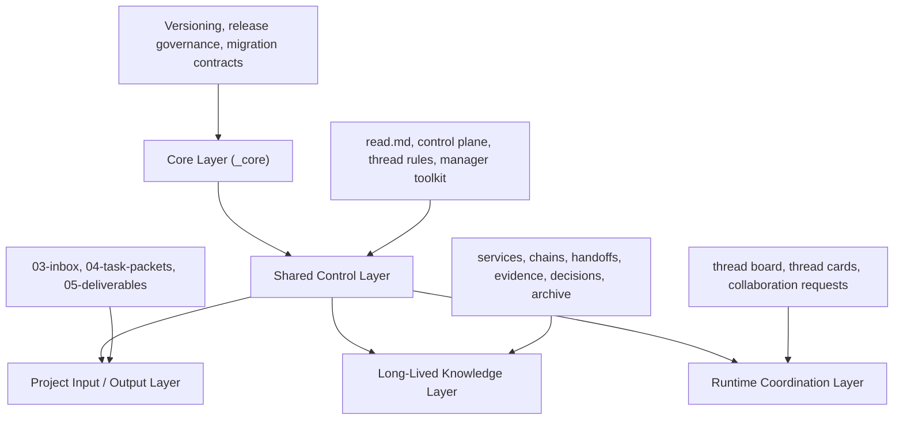

<p align="right">
  English · <a href="./README.zh-CN.md">简体中文</a>
</p>

<div align="center">
  <h1>CodeWinter</h1>
  <p><strong>Portable control plane for multi-thread AI coding.</strong></p>
  <p>Turn isolated AI chats into a governed, upgradeable engineering workflow.</p>

  <p>
    
    
    
    
  </p>
</div>

> **CodeWinter** is a portable control plane for making multiple AI threads collaborate like a managed engineering team.  
> It gives manager threads, execution threads, runtime visibility, project memory, and instance migration a single operating model.

The name comes from **code + winter**.  
**CodeWinter** is the brand; the system itself is designed as a portable, long-running collaboration control plane.

## Why CodeWinter exists

Most AI coding workflows eventually fail in the same places:

- one thread grows too long and loses focus
- useful context stays trapped in chat history
- multi-module work becomes difficult to coordinate
- inputs, outputs, evidence, and long-term knowledge get mixed together
- switching tools breaks continuity
- upgrading the collaboration system itself becomes risky once a project is already running

**CodeWinter** turns that hidden mess into an explicit operating model.

## What CodeWinter gives you

| Capability | What it means |
| --- | --- |
| Manager / execution separation | Governance stays in one place while bounded work happens in focused threads |
| Runtime coordination | Threads can expose status, blockage, handoff readiness, and collaboration intent |
| Externalized project memory | Important knowledge lives in files, not in one lucky conversation |
| Harness-first guidance | Threads are not only constrained, but actively guided toward higher-quality behavior |
| Instance migration | Running project instances can follow CodeWinter upgrades without blind folder replacement |

## Core ideas

### Progressive Disclosure
Threads read the smallest useful context first, then expand only when the task requires it.

### Manager / Execution Separation
The manager thread governs, routes, integrates, and archives.  
Execution threads focus on bounded modules, chains, implementations, and validations.

### Externalized State
Project memory should live in the filesystem, not inside a single conversation window.

### Evidence Before Memory
Not everything that happened deserves to become long-term knowledge.  
Only adopted, verified, reusable information should be written back.

### Runtime Coordination Layer
Threads may not be able to message each other directly, but they can still expose:

- who exists
- what they are doing
- whether they are blocked
- whether they need collaboration
- whether they are ready for handoff

### Harness Engineering
CodeWinter does not only constrain AI behavior. It also guides it.

Instead of relying on "be smart" as the default policy, CodeWinter uses:

- default paths
- control gates
- structured templates
- runtime signals
- feedback loops
- correction mechanisms

### Instance Migration Over File Replacement
Upgrading a running CodeWinter project should be treated as **instance migration**, not "copy a new folder over the old one."

## System shape



## Repository structure

```text
_core/                 core principles, versioning, release governance, migration
00-control-plane/      instance control plane, active queue, runtime coordination
01-thread-rules/       collaboration rules, harness rules, runtime rules
02-manager-toolkit/    prompt templates and manager actions
03-inbox/              raw intake for the manager thread
04-task-packets/       task delivery packages for execution threads
05-deliverables/       human-readable formal outputs
10-90/                 long-lived service / chain / evidence / decision / archive layers
_console/              optional operator console for human interaction
read.md                starter entry for threads
```

## Quick start

1. Put `CodeWinter` into a project root.
2. Open a fresh AI thread and assign it the `Manager Lease`.
3. Start from:
   - [`./read.md`](./read.md)
   - [`./02-manager-toolkit/bootstrap-manager.md`](./02-manager-toolkit/bootstrap-manager.md)
4. Let the manager thread bootstrap the instance:
   - identify workspace shape
   - detect stack and entrypoints
   - initialize the control plane
   - initialize runtime coordination
   - establish instance metadata
5. Only after bootstrap, start dispatching execution threads.

## Operator Console

This repository also includes an optional downstream UI:

- [`./_console/`](./_console/)

The console exists to improve human interaction and reduce operator mistakes.  
It is **not** the source of truth for the collaboration system.

CodeWinter remains authoritative.  
The console only consumes projected state from the CodeWinter filesystem.

## Current release

Current core baseline:

- `release_version`: `v0.1.1`
- `release_channel`: `draft`
- `release_theme`: `CodeWinter v0.1.x Harness Upgrade`
- `release_codename`: `Carrot on a Stick`

This means:

- the system is already usable
- the architecture is real, not hypothetical
- the core is still in active refinement
- real instance validation is the next major step

## Recommended entrypoints

- [`read.md`](./read.md)
- [`bootstrap-v1.md`](./_core/bootstrap-v1.md)
- [`versioning-model-v1.md`](./_core/versioning-model-v1.md)
- [`release-manifest.md`](./_core/release-manifest.md)
- [`bootstrap-manager.md`](./02-manager-toolkit/bootstrap-manager.md)

## License

This project is released under the [MIT License](./LICENSE).

## One-line summary

CodeWinter is not a prompt pack and not a single AI thread.  
It is a control system for making multiple AI threads collaborate like a managed engineering team.
