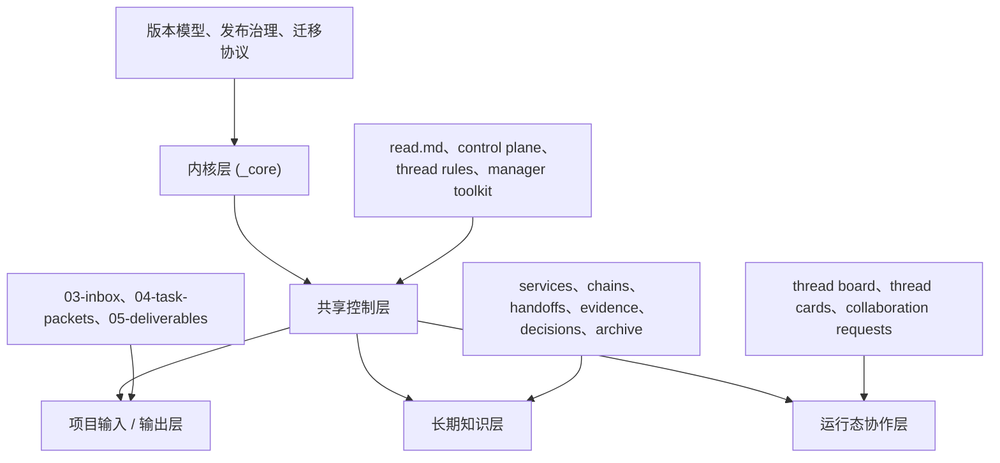

<p align="right">
  <a href="./README.md">English</a> · 简体中文
</p>

<div align="center">
  <h1>CodeWinter</h1>
  <p><strong>面向多线程 AI Coding 的可移植协作控制面。</strong></p>
  <p>让分散的 AI 对话变成可治理、可升级、可长期运行的工程协作工作流。</p>

  <p>
    
    
    
    
  </p>
</div>

> **CodeWinter** 是一套面向真实研发场景的多线程 AI 协作控制系统。  
> 它不是提示词集合，也不是某一个固定会话，而是一套把管理线程、执行线程、运行态可见性、项目记忆和实例迁移统一起来的协作操作模型。

`CodeWinter` 这个名字来自 **code + winter**。  
它是项目品牌名，而系统本身的定位，是一套可移植、可持续运行的 AI 协作控制面。

## 为什么需要 CodeWinter

大多数 AI Coding 工作流，最终都会在类似的问题上失控：

- 单线程上下文越来越长，最后失焦
- 有价值的信息留在聊天记录里，难以复用
- 多模块、多仓库、前后端联动后协作成本迅速上升
- 输入、输出、证据、长期知识混在一起
- 切换工具后连续性中断
- 当项目已经开始运行后，协作系统本体本身又很难安全升级

**CodeWinter** 的目标，就是把这些隐性混乱显式结构化，让 AI 协作从零散对话升级成工程化系统。

## CodeWinter 提供什么

| 能力 | 含义 |
| --- | --- |
| 管理 / 执行分离 | 管理治理集中在一个控制面里，具体工作交给边界清晰的执行线程 |
| 运行态协作 | 线程可以暴露状态、阻塞、接力准备度与协作意图 |
| 外部化项目记忆 | 重要信息写入文件系统，而不是留在某次幸运的对话里 |
| Harness 优先 | 线程不仅被约束，还会被系统主动引导到更高质量的协作路径 |
| 实例迁移 | 已运行项目可以跟随 CodeWinter 升级，而不是靠覆盖文件夹硬切 |

## 核心思想

### 渐进式披露
线程优先读取最小必要上下文，只有在任务真的需要时才继续扩展。

### 管理线程 / 执行线程分工
管理线程负责治理、路由、收口、归档和系统节奏；执行线程负责具体模块、链路、实现和验证。

### 状态外部化
项目记忆应该存在文件系统中，而不是绑定在某一个聊天窗口里。

### 先证据，后记忆
并不是“真实发生过的事情”都值得沉淀。只有已采纳、已验证、可复用的信息，才应该进入长期知识层。

### 运行态协作层
线程之间即使不能直接通信，也可以通过共享控制面暴露：

- 谁存在
- 正在做什么
- 是否阻塞
- 是否需要协作
- 是否准备好交接

### Harness Engineering
CodeWinter 不只约束 AI 行为，也会主动引导它。

它不是把“你应该聪明一点”当默认策略，而是通过：

- 默认路径
- 控制门
- 结构化模板
- 运行态信号
- 反馈回路
- 纠偏机制

让多线程协作更稳定地产生高质量结果。

### 实例迁移优先于文件覆盖
升级一个已经在运行的 CodeWinter 项目，应该被视为**实例迁移**，而不是“把新文件夹覆盖到旧文件夹上”。

## 系统结构



## 仓库结构

```text
_core/                 内核原则、版本模型、发布治理、迁移协议
00-control-plane/      实例控制面、active queue、运行态协作
01-thread-rules/       协作规则、Harness 规则、运行层规则
02-manager-toolkit/    提示词模板与管理动作
03-inbox/              给管理线程的原始输入
04-task-packets/       给执行线程的任务包
05-deliverables/       面向人的正式输出
10-90/                 服务 / 链路 / 证据 / 决策 / 归档层
_console/              可选的 Operator Console
read.md                线程统一 Starter
```

## 快速开始

1. 把 `CodeWinter` 放进项目根目录。
2. 新开一个 AI 线程，让它担任当前项目的 `Manager Lease`。
3. 从以下入口开始：
   - [`./read.md`](./read.md)
   - [`./02-manager-toolkit/bootstrap-manager.md`](./02-manager-toolkit/bootstrap-manager.md)
4. 让管理线程完成实例 Bootstrap：
   - 识别工作区形态
   - 确认技术栈与入口
   - 初始化控制面
   - 初始化运行态协作层
   - 建立实例元信息基线
5. Bootstrap 完成后，再开始派发执行线程。

## Operator Console

仓库里也包含一个可选的下游桌面操作台：

- [`./_console/`](./_console/)

它的作用是优化人机交互、降低误操作风险。  
但它**不是**协作系统的真相源。

CodeWinter 本体仍然是唯一事实来源。  
Console 只消费 CodeWinter 文件系统投影出来的状态。

## 当前发布

当前核心基线：

- `release_version`: `v0.1.1`
- `release_channel`: `draft`
- `release_theme`: `CodeWinter v0.1.x Harness Upgrade`
- `release_codename`: `Carrot on a Stick`

这意味着：

- 系统已经可用
- 架构已经真实存在，不只是概念设计
- 核心仍在持续收敛
- 下一阶段重点是实例验证与 `candidate` 级加固

## 推荐入口

- [`read.md`](./read.md)
- [`bootstrap-v1.md`](./_core/bootstrap-v1.md)
- [`versioning-model-v1.md`](./_core/versioning-model-v1.md)
- [`release-manifest.md`](./_core/release-manifest.md)
- [`bootstrap-manager.md`](./02-manager-toolkit/bootstrap-manager.md)

## 协议

本项目采用 [MIT License](./LICENSE)。

## 一句话总结

CodeWinter 不是一个提示词包，也不是某一个固定 AI 线程。  
它是一套让多个 AI 线程像受治理、可升级、可长期协作的工程团队一样工作的控制系统。
